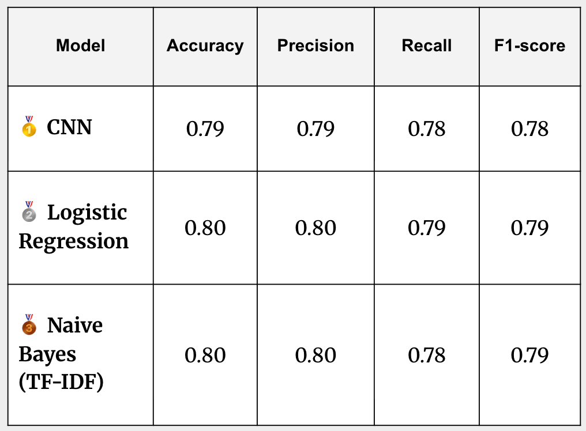

# Disaster Tweet Classifier

An end-to-end NLP project to classify tweets as **disaster-related** (1) or **non-disaster** (0).  
This repository contains:

- Data preprocessing & modeling notebooks
- A trained Convolutional Neural Network (CNN) model
- An interactive [Streamlit](https://nlp-tweet-disaster-classifier.streamlit.app/) app for real-time predictions and a behind the scences look at preprocessing steps and misqualified Tweets.

---

## Project Overview

The aim of this project is to build and deploy a machine learning model that predicts whether a given tweet refers to a real disaster. The dataset contains 10,000 labeled tweets (from the [Kaggle competition](https://www.kaggle.com/competitions/nlp-getting-started)).

**Key features:**

- Robust preprocessing pipeline (cleaning, tokenization, stopword removal, lemmatization)
- Multiple model comparisons (Logistic Regression, Naive Bayes, FNN, CNN)
- Hyperparameter tuning for performance optimization
- Deployed Streamlit app with both **user input** and **random test tweet** predictions

---

## Repository Structure

```
NLP_Tweet_Disaster_Classifier/
├── app/
│   ├── app.py                                # Main Streamlit app
│   ├── model/
│   │   ├── cnn_disaster_classifier.keras     # Main model used in app deployment
│   │   └── tokenizer.pickle                  # Tokenizer used for CNN model and app deployment
│   ├── data/
│   │   └── test_sample.csv                   # Tweets from the test set for demo
│   ├── images/                               # Charts & visualizations
│   ├── reports/                              # Classification reports, CSV summaries
├── notebooks/                                # Jupyter notebooks for cleaning, EDA & modeling
├── requirements.txt                          # Project dependencies
├── runtime.txt                               # Python version for deployment
└── README.md                                 # This file
```

---

## Pipeline

1. **Data Cleaning**

   - Lowercasing, accent removal
   - Removing URLs, mentions, hashtags, punctuation, numbers, extra whitespace
   - Dropping words with only 1 character

2. **Tokenization & Lemmatization**

   - POS tagging to choose correct lemma
   - Stopword removal (NLTK + custom stopwords)

3. **Vectorization**

   - Experiments with `CountVectorizer` (n-grams) and `TfidfVectorizer`

4. **Model Training & Evaluation**

   - Baselines: Logistic Regression, Naive Bayes
   - Deep Learning: LSTM, CNN
   - CNN achieved the best weighted F1 score (~0.80)

5. **Deployment**
   - Trained CNN + tokenizer loaded in Streamlit app
   - User can:
     - Enter custom text
     - Generate a random tweet from test set
     - View preprocessing steps and prediction probability
     - Model summary & EDA pages

---

## Model Performance



---

## Running Locally

### 1. Clone the repository

```bash
git clone hhttps://github.com/Dido-D-B/NLP_Tweet_Disaster_Classifier/tree/main.git
cd NLP_Tweet_Disaster_Classifier
```

### 2. Create & activate a virtual environment

```bash
python -m venv .venv
source .venv/bin/activate  # Mac/Linux
.venv\Scripts\activate     # Windows
```

### 3. Install dependencies

```bash
pip install --upgrade pip
pip install -r requirements.txt
```

### 4. Run the app

```bash
streamlit run app/app.py
```

---

## Deployment

This project is deployed on **Streamlit Cloud**.  
Simply push updates to `main` and the app will rebuild.  
**Runtime**: Python 3.11 (see `runtime.txt`)

---

## Dependencies

- streamlit
- tensorflow / tensorflow-macos
- numpy, pandas, matplotlib, pillow
- scikit-learn
- nltk

---

## Known Limitations

- Model trained on ~10k tweets; may not generalize perfectly to all contexts
- Sarcasm, humor, or indirect disaster references can confuse the classifier
- Tokenizer is fixed; retraining required for new vocab

---

## Acknowledgements

- [Kaggle NLP Getting Started competition](https://www.kaggle.com/competitions/nlp-getting-started) for dataset
- Streamlit for easy deployment
- TensorFlow/Keras for deep learning framework